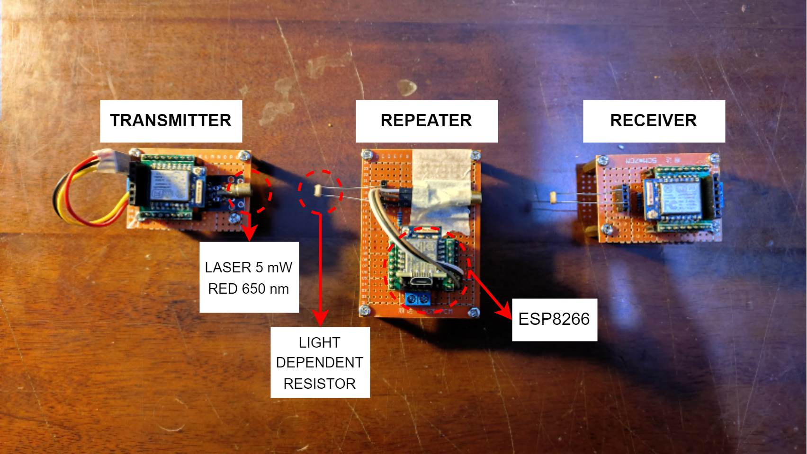
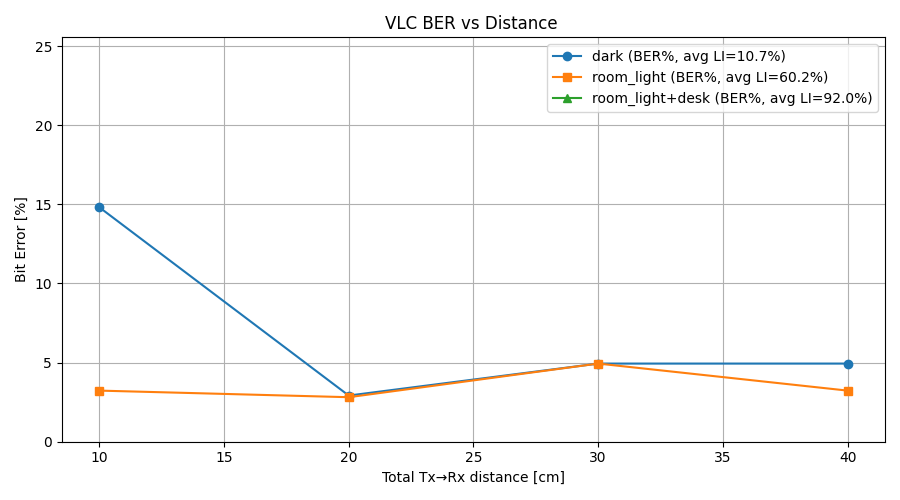

# simple-vlc

A simple **Visible Light Communication (VLC / Li‑Fi)** proof‑of‑concept project built using microcontrollers and lasers. This project demonstrates basic binary data transmission using light intensity modulation, including a transmitter, repeater, and receiver, along with error detection and bit‑error‑rate (BER) evaluation.

---

## Overview

Visible Light Communication (VLC) uses modulated light sources (e.g., lasers) to transmit data through free space. In this project:

* Digital data is encoded into binary symbols
* An laser acts as the optical transmitter
* A photodiode / light sensor captures the signal at the receiver
* A repeater node can regenerate and forward the signal

The goal of this repository is educational: to provide a **clear, minimal, and reproducible VLC experiment** suitable for embedded systems learning and research prototyping.

---

## System Architecture

The system consists of three main nodes:

1. **Transmitter**
   Encodes digital data into a binary optical signal by modulating laser intensity.

2. **Repeater (optional)**
   Receives the optical signal, decodes it, and retransmits it to extend communication distance or improve reliability.

3. **Receiver**
   Detects incoming light signals, reconstructs the binary data, and evaluates transmission quality.

### Architecture Diagram

The following diagram shows the high‑level VLC architecture used in this project:


### Binary Transmission Concept

A simplified binary modulation scheme is illustrated below, where logical `1` and `0` are represented by different laser light states:



---

## Repository Structure

```text
simple-vlc/
├── src/                     # Firmware source code
├── include/                 # Header files
├── platformio.ini           # PlatformIO configuration
├── docs/
│   ├── pictures/            # Architecture & concept diagrams
│   ├── experimental-results/# Experimental plots & results
│   └── videos/              # Demonstration videos
└── README.md
```

---

## Build and Flash

This project uses **PlatformIO** for building and flashing firmware.

```bash
# flash transmitter
pio run -e transmitter            # Build only
pio run -e transmitter -t upload  # Build and upload to the board

# flash repeater
pio run -e repeater               # Build only
pio run -e repeater -t upload     # Build and upload to the board

# flash receiver
pio run -e receiver               # Build only
pio run -e receiver -t upload     # Build and upload to the board
```

> Make sure the correct board and serial port are configured in `platformio.ini` before uploading.

---

## Experimental Results

Experimental measurements were conducted to evaluate signal integrity, decoding accuracy, and overall communication reliability.

### Results Visualization

The following figure summarizes the experimental observations and decoding performance:



### Observations

* Stable binary transmission was achieved under controlled lighting conditions
* Error detection successfully identified corrupted frames
* Bit Error Rate (BER) can be calculated from received vs transmitted bits
* Ambient light significantly affects reception quality

---

## Demonstration Videos

The following videos demonstrate the VLC system operation and debugging process. Due to GitHub limitations, videos are stored in the repository and linked below.

### 1. End‑to‑End VLC Demonstration

Shows the complete visible light communication process from transmitter to receiver, including laser modulation and successful data reception.

📹 **example-simple-vlc.mp4**
Path: `docs/videos/example-simple-vlc.mp4`

> This video demonstrates real‑time optical data transmission using laser intensity modulation.

---

### 2. Receiver Serial Monitor Output

Shows the serial monitor output at the receiver side, including decoded data, error detection, and debugging information.

📹 **serial-monitor.mp4**
Path: `docs/videos/serial-monitor.mp4`

> Useful for understanding timing behavior, decoding accuracy, and error handling.

---

## Features

* Binary VLC transmission using lasers
* Error detection mechanism
* Bit Error Rate (BER) calculation
* Optional repeater for signal regeneration
* Modular transmitter / repeater / receiver firmware

---

## TO‑DO / Status

* Make an error detection → **Done**
* Calculate bit error rate → **Done**
* Make a repeater → **Done**

---

## Notes & Limitations

* Performance depends heavily on ambient lighting conditions
* Line‑of‑sight alignment is critical
* This implementation prioritizes clarity over maximum data rate

---

## License

This project is intended for educational and research purposes. Add a license file if redistribution is planned.

---

## Acknowledgments

Inspired by basic Li‑Fi and VLC concepts commonly used in optical wireless communication research.